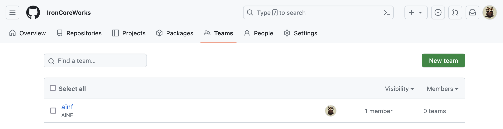
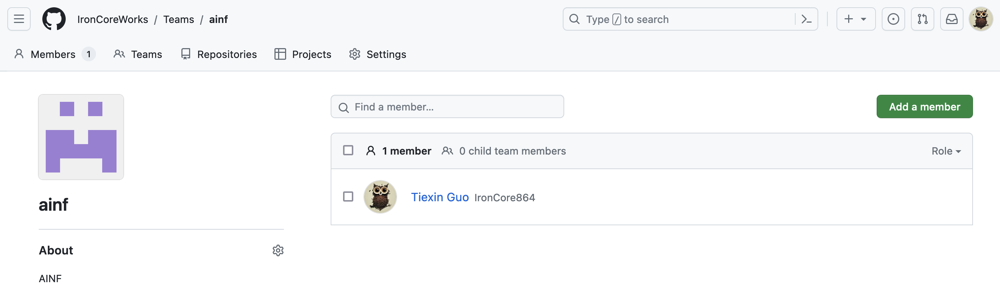

# Use Terraform CDK to Manage GitHub Teams and Membership

## 1 Prerequisites

### 1.1 GitHub App

We use GitHub App as the authentication method for Terraform.

Create a GitHub App. See [the official doc here](https://docs.github.com/en/apps/creating-github-apps/registering-a-github-app/registering-a-github-app) for more details.

Take note of
- app_id
- installation_id

Then, create, download and store a private key for the GitHub App. Name the downloaded private key file as `gh-iac-test.private-key.pem`, and put it under the `ROOT_OF_THIS_REPO/terraform` folder.

These will be used in the GitHub provider config.

### 1.2 Environment Variables

```bash
unset GITHUB_ORGANIZATION
unset GITHUB_OWNER
```

This is because for backwards compatibilities, if both GITHUB_OWNER, GITHUB_ORGANIZATION and owner (in the provider config) are set, the two ENV vars above take higher priority.

_Note: in this demo, we are reading the private key file locally, and this SHOUT NOT be done in production. In production, try storing sensitive information in a secrets manager, and use Terraform data to read from the secrets manager._

---

## 2 Install CDKTF

```bash
npm install --global cdktf-cli@latest
```

---

## 3 Config

Use your favourite text editor to open `main.ts`, and update the "Configure the GitHub provider" section:

```typescript
    // Configure the GitHub provider
    const privateKey = fs.readFileSync('../terraform/gh-iac-test.private-key.pem', 'utf8');
    new github.provider.GithubProvider(this, 'gh', {
      owner: "ironcoreworks",
      appAuth: {
        id: "359910",
        installationId: "39547792",
        pemFile: privateKey
      }
    });
```

- Update the location of the private key.
- Update the owner, id, installationId.

For more information, see [here](../terraform/README.md#11-github-app).

---

## 4 Init and Deploy

```bash
npm i
cdktf deploy
```

---

## 5 Result

Teams:



Members:



---

## 6 Tear Down

```bash
cdktf destroy
```
